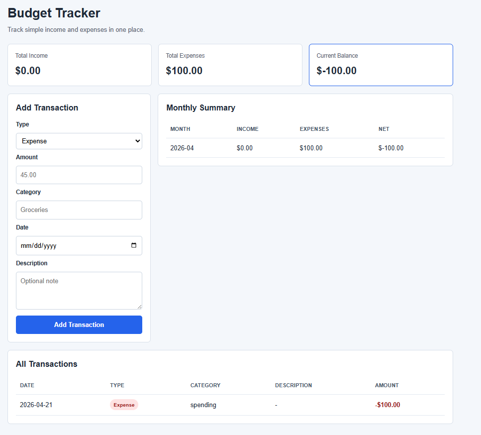

# Budget Tracker App

This is a simple budget tracking web app built using Flask and SQLite.  
I created this project to practise building a full working application where users can add income and expenses and see a running balance.

The focus was on keeping the app simple while still covering backend logic, database storage, and a basic frontend interface.

---

## Screenshot

---

## Features

- Add income and expense entries  
- Save transactions with amount, category, date and description  
- View all transactions in a table  
- See total income, total expenses, and current balance  
- Monthly summary of spending  
- Basic input validation for amount and date  

---

## Tech Stack

- Python  
- Flask  
- SQLite  
- HTML  
- CSS  

---

## Project Structure
budget-tracker/
|-- app.py
|-- requirements.txt
|-- README.md
|-- database.db
|-- templates/
| |-- index.html
|-- static/
| |-- style.css

---

## Notes

This project was built as a personal practice project to improve my understanding of Flask and working with databases.

There are still features that could be improved, such as adding filters, editing or deleting transactions, and improving the UI, which I plan to work on next.
